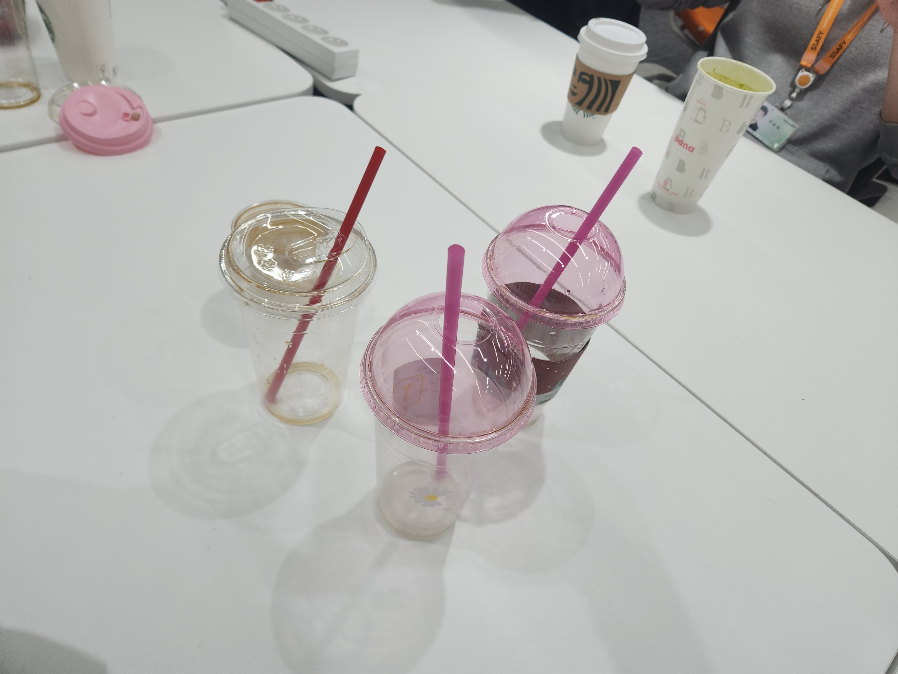
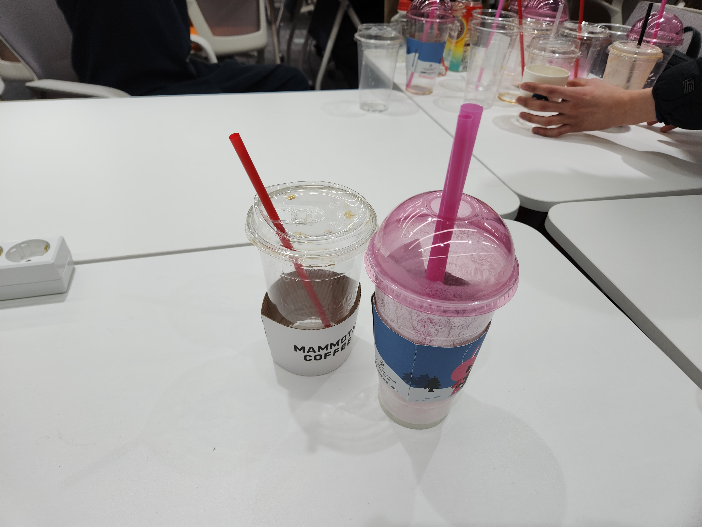
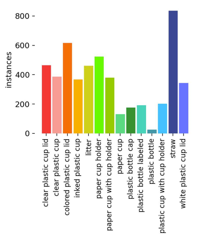
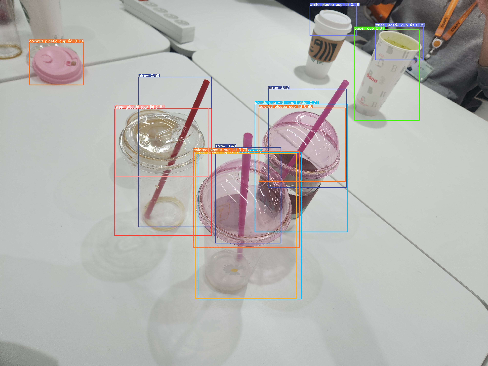
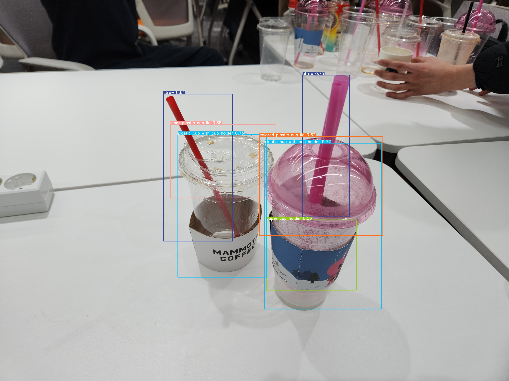

# Recycling Is Fun
## 📜 프로젝트 설명
### 개요
- 일회용품 사용을 줄일 수 있게 합니다
- 일회용품을 사용한다면 제대로 분리수거하여 재사용할 수 있게 합니다

### 타겟
- 분리수거가 익숙하지 않은 사람
- 올바른 분리수거 방법이 헷갈리는 사람
---
### 배경
일상에서 주로 사용하는 플라스틱컵이 제대로 분리수거 되고 있지 않음
### 목적
직접 분리수거 해보면서 즉각 피드백을 통해 잘못된 분리수거 의식을 바로 잡기 위해 프로젝트를 기획
### 구성
- 분리수거 기기를 통해 플리스틱컵을 직접 분리수거 해보고 즉각 피드백 통해 분리수거 의식을 향상시킵니다.
- 웹 모바일에서 분리수거 이력에 대한 보상으로 게이미피케이션 요소를 추가하여 지속적으로 분리수거 기기 사용을 유도합니다.
## 🎬영상

## 🖼화면

| |  |
| ------ | ------ |
|
 **메인** 
  | 
 **홈** 
|
|
 **로그인** 
  | 
 **마이페이지** 
|
|  
 **메인** 
  | 
 **홈** 
|

## 🙆효과

|날짜|프로젝트 도입 이전|프로젝트 도입 이후|
|:--------:|:--------:|:----:|
|2023.01.19|1개 / 15개|      |
|2023.01.20|3개 / 19개|      |
|2023.01.25|0개 / 10개|      |
|2023.01.26|2개 / 16개|      |
|2023.01.27|6개 / 15개|      |
|2023.02.01|2개 / 17개|      |

## 🛠사용법

### 설치

> #### 프론트 빌드
>- `git pull test_master` 

> #### 서버 빌드
>- `ㅁㄴㅇ`

## 🛢기술스택

|임베디드|프론트 엔드|백 엔드|머신 러닝|인프라|툴
|:-:|:-:|:-:|:-:|:-:|:-:|
|   |      |     |  |    |     |

## 시스템 구성도

## 팀원 역할

---

## 주요 기능

### 1. 🖼 욜로 모델을 활용한 이미지 분석

#### 사용 데이터셋

프로젝트의 목적성에 비추어 보았을 때, "**실제 SSAFY 강의장에서 발생하는 쓰레기**"를 대상으로 데이터셋을 만드는 것이 적합하다고 판단하였고, 데이터셋을 직접 제작하였습니다.

- **사용 이미지** : SSAFY 쓰레기통에서 발생한 커피 쓰레기 사진 **253**장

|예시 이미지 1| 예시 이미지 2|
|:--:|:--:|:--:|
|||

- **클래스** 

색이 있는 플라스틱은 재활용이 어렵다는 점에 착안하여 <u>색의 유무</u>에 따라 우선적으로 클래스를 분류하였으며, 빨대와 컵홀더와 같은 기타 부산물 역시 분류하고자 하는 클래스에 추가하였습니다.

|id| 클래스명 |설명|
|:--:|:--:|:--:|
|0|clear plastic cup| 별도의 프린팅이 되어있지 않은 투명한 플라스틱 커피컵 (ex. **매머드커피**) |
|1|clear plastic cup lid| 별도의 프린팅이 되어있지 않은 투명한 플라스틱 커피컵의 뚜껑 |
|2|colored plastic cup lid| 색이 입혀진 투명한 플라스틱 커피컵의 뚜껑 (ex. **바나프레소**)|
|3|white plastic cup lid| 흰색의 불투명한 플라스틱 커피컵의 뚜껑|
|4|plastic bottle| 라벨이 제거된 투명한 상테의 페트병 |
|5|plastic bottle labeled|라벨이 제거되지 않은 상태의 페트병|
|6|plastic bottle cap| 페트병의 뚜껑 |
|7|paper cup| 인쇄여부를 구분하지 않는 종이컵 |
|8|straw| 재질을 구분하지 않은 빨대 |
|9|inked plastic cup| 별도의 프린팅이 입혀진 투명한 플라스틱 커피컵 (ex. **바나프레소**, **스타벅스**)|
|10|label|페트병 라벨|
|11|litter|기타 일반 쓰레기 (커피컵 스티커) |
|12|paper cup holder| 종이 컵홀더 |
|13|plastic cup with cup holder| 인쇄 및 색의 여부를 고려하지 않는, 컵홀더가 씌워진 플라스틱 컵|
|14|paper cup with cup holder|컵홀더가 씌워진 종이 컵|

- **데이터 증강**
1. RandomHorizontapFlip
2. RandomCrop (0% ~ 20%)
3. Rotation (-15 deg ~ +15 deg)

#### 사용 모델

모델은 [yolov5](https://github.com/ultralytics/yolov5)을 사용하였으며, 데이터 증강으로 얻은 약 800장의 사진을 85(train) : 10(valid) : 5(test)  비율로 나눠 학습하였습니다.

5개의 Pretrained Model 에 대하여 각각 BackBone Layer를 고정시켜 100 epochs씩 학습하였으며, 과적합을 방지하기 위해 15 epoch 이상 성능의 개선이 없으면 학습을 종료하는 Early Stopping 기법을 사용하였습니다.

|model|mAP$_{0.5}$ (last / best)|mAP$_{0.5:0.95}$ (last / best)|
|:--:|:--:|:--:|:--:|
|yolov5s6| **0.92241** / 0.94122|0.60246 / 0.65301|
|yolov5m6|0.91761 / 0.93395 |0.5427 / 0.67914|
|yolov5s|0.9152 / 0.92468|0.53308 / 0.60605|
|yolov5m|0.9156 / 0.93853| 0.63864 / 0.66291|
|yolov5x|0.91881 / **0.94299** |**0.72446** / **0.74659**|

이후 모델의 성능과 사진을 인식하고 결과를 출력할 때까지의 시간을 모두 고려해보았을 때, yolov5s6가 프로젝트에 가장 적합하다고 판단하여 해당 모델을 본 프로젝트에 적용하였습니다.

#### 학습 결과

|예시 이미지 1| 예시 이미지 2|
|:--:|:--:|:--:|
|||